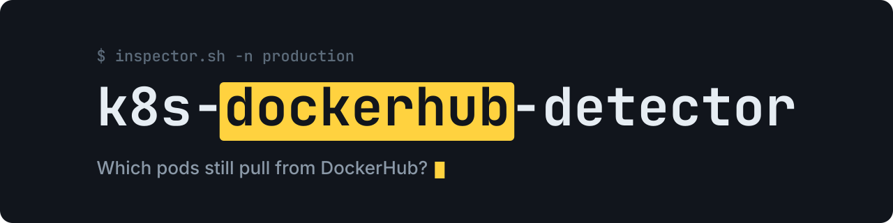

<p align="center">
  
</p>

<h1 align="center">k8s-dockerhub-detector</h1>

<p align="center">Lists every pod in a Kubernetes cluster that still pulls images from Docker Hub, so you can move them before the pull rate limit bites.</p>

<p align="center">
  <a href="LICENSE"></a>
</p>

---

A bash script over `kubectl`: it reads the images of the containers and init containers of every pod, treats an image with no registry host (or with `docker.io`) as Docker Hub, prints the matching pods grouped by namespace, and ends with totals of all and of distinct Docker Hub images.

## Quick start

```bash
curl -O https://raw.githubusercontent.com/GeiserX/k8s-dockerhub-detector/main/inspector.sh
bash inspector.sh              # every namespace; add -n <namespace> for one
```

Needs `kubectl` pointed at the cluster and bash 4 or newer (the script uses associative arrays; macOS ships bash 3.2, so use Homebrew's bash there).

## License

[GPL-3.0-or-later](LICENSE)
